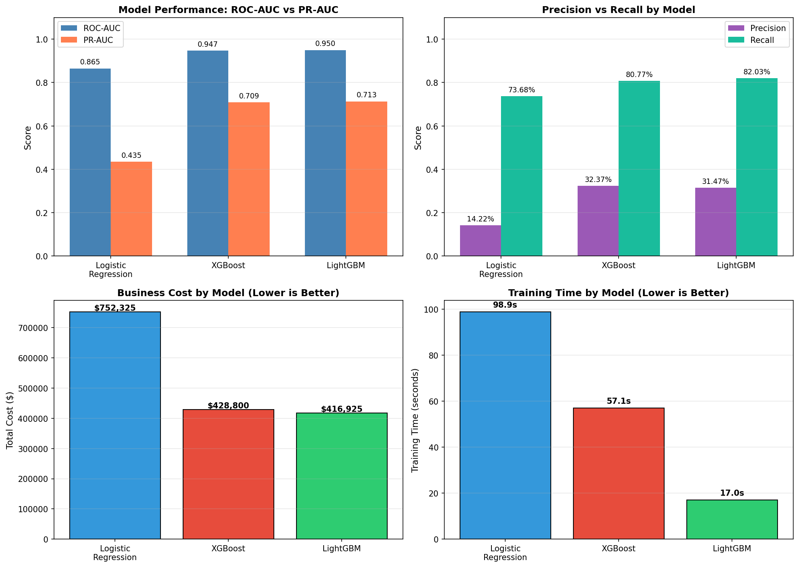
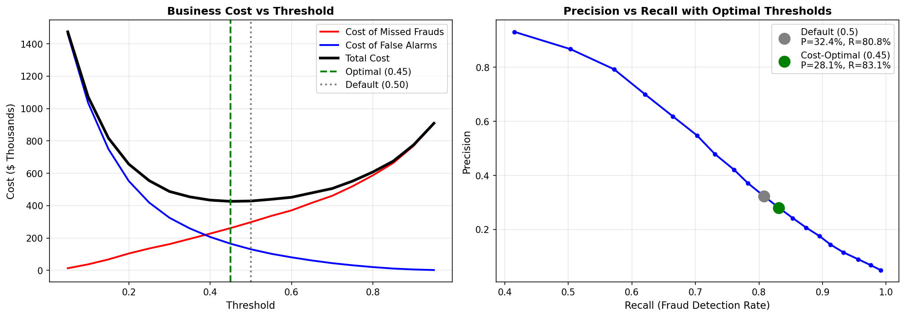
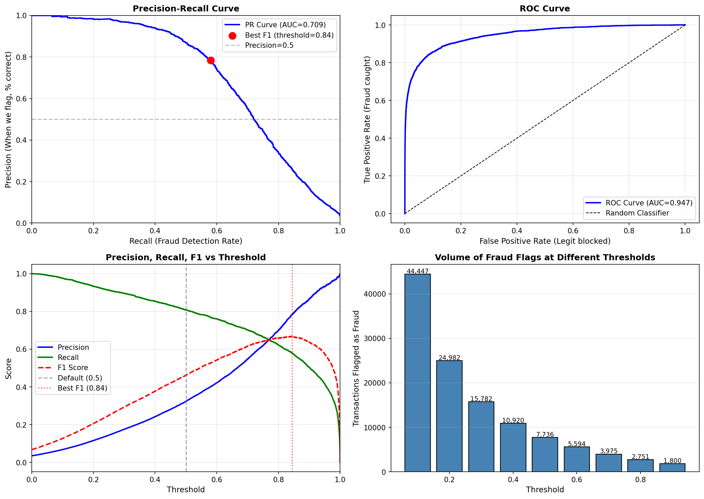
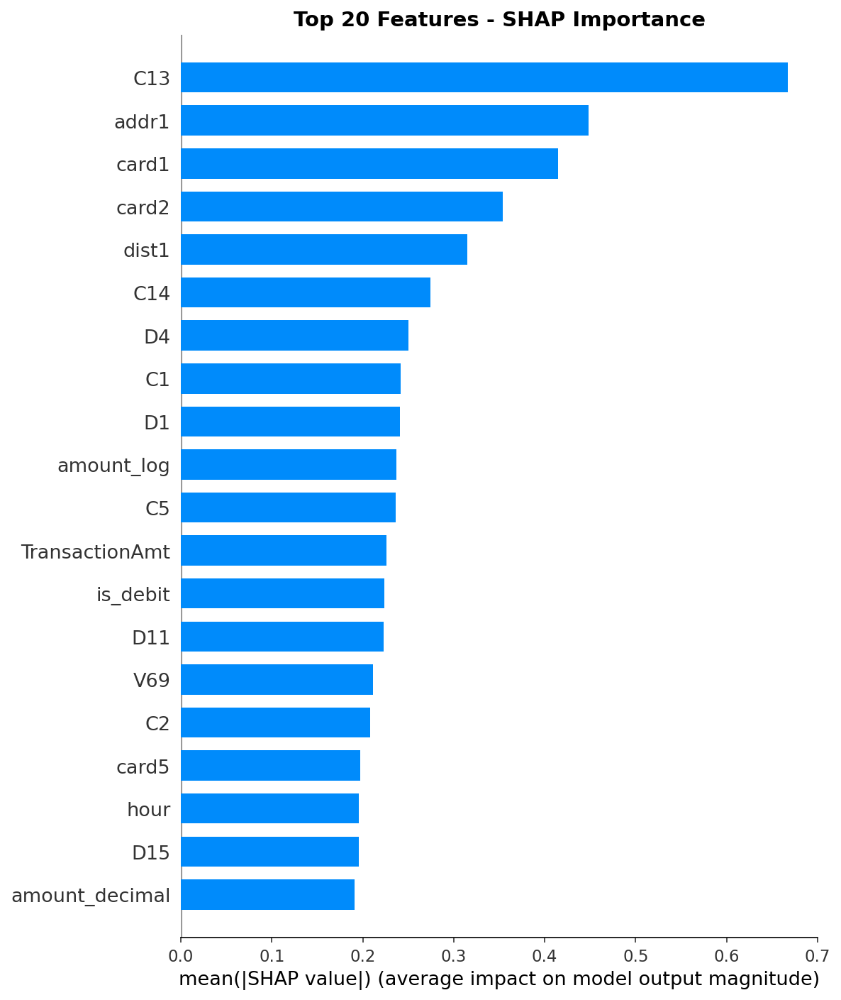
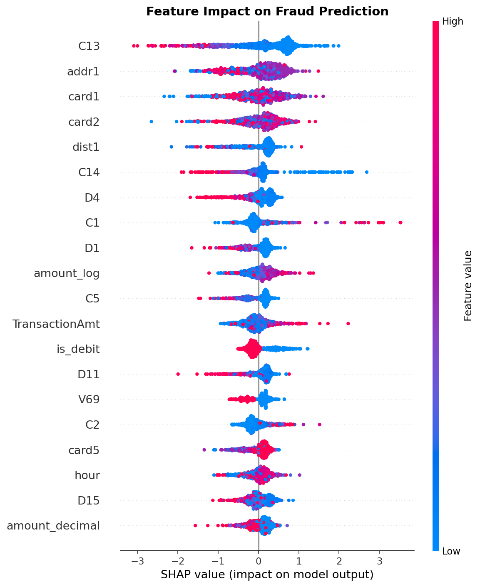

# 🛡️ Credit Card Fraud Detection System

A production-ready machine learning system for real-time credit card fraud detection, built with LightGBM, FastAPI, and Streamlit.


---

## 📊 Project Overview

This project implements an end-to-end fraud detection pipeline using the **IEEE-CIS Fraud Detection** dataset from Kaggle. The system achieves **96.58% ROC-AUC** and reduces business costs by **58.3%** compared to baseline approaches.

### Key Features

- **High Performance**: 83.5% fraud detection rate with optimized threshold
- **Real-time Scoring**: FastAPI backend for instant predictions
- **Interactive Dashboard**: Streamlit UI for transaction analysis
- **Explainable AI**: SHAP-based feature importance and local explanations
- **Business-Optimized**: Threshold tuned for minimum operational cost

---

## 🎯 Model Performance

| Metric | Score |
|--------|-------|
| ROC-AUC | 0.9658 |
| PR-AUC | 0.8355 |
| Precision | 52.68% |
| Recall | 83.51% |
| F1 Score | 0.6460 |

### 📈 Model Comparison



## 🔬 Evaluation & Data Integrity

### Confusion Matrix (Threshold = 0.10)

|  | Predicted Legitimate | Predicted Fraud |
|--|---------------------|-----------------|
| **Actual Legitimate** | 83,157 (TN) | 2,325 (FP) |
| **Actual Fraud** | 511 (FN) | 2,588 (TP) |

### Data Split Strategy

- **Split Ratio:** 70% Train / 15% Validation / 15% Test (stratified)
- **No Data Leakage:** Scaler fitted on training data only, then applied to validation and test sets
- **Time-aware:** Features engineered before splitting to prevent look-ahead bias

### Metrics at Chosen Threshold (0.10)

| Metric | Value |
|--------|-------|
| ROC-AUC | 0.9658 |
| PR-AUC | 0.8355 |
| Precision | 52.68% |
| Recall | 83.51% |
| F1 Score | 0.6460 |

---

## 📊 Production Monitoring Plan

| Component | Method | Frequency |
|-----------|--------|-----------|
| **Data Drift** | Population Stability Index (PSI) on key features | Weekly |
| **Model Performance** | Track ROC-AUC on newly labeled transactions | Monthly |
| **Prediction Drift** | Monitor fraud rate predictions vs actuals | Daily |
| **Retraining Trigger** | If ROC-AUC drops >5% or fraud patterns shift | As needed |

### Alert Thresholds

| Condition | Action |
|-----------|--------|
| Fraud rate changes >20% | Investigate data quality |
| Precision drops below 40% | Review false positive patterns |
| Recall drops below 75% | Urgent model review |

### Business Impact

| Metric | Value |
|--------|-------|
| Frauds Caught | 83.51% (2,588 / 3,099) |
| Frauds Missed | 511 |
| False Alarm Rate | 2.72% |
| Total Cost | $313,625 |
| **Savings vs Baseline** | **$438,700 (58.3%)** |
| **Projected Annual Savings (1M txns)** | **$4.95 Million** |

### 💰 Business Cost Optimization



---

## 🎯 Threshold Analysis

The optimal threshold (0.10) was determined by analyzing the precision-recall tradeoff and business costs at different classification thresholds.



---

## 🏗️ System Architecture

```
┌─────────────────┐     ┌─────────────────┐     ┌─────────────────┐
│   Streamlit     │────▶│    FastAPI      │────▶│   LightGBM      │
│   Dashboard     │     │    Backend      │     │   Model         │
│   (Frontend)    │◀────│    (api.py)     │◀────│   (426 features)│
└─────────────────┘     └─────────────────┘     └─────────────────┘
```

---

## 📁 Project Structure

```
FraudDetection/
├── api.py                    # FastAPI backend
├── app.py                    # Streamlit dashboard
├── modeling.ipynb            # Model training notebook
├── eda.ipynb                 # Exploratory data analysis
├── feature_eng.ipynb         # Feature engineering
├── fraud_model.joblib        # Trained LightGBM model
├── scaler.joblib             # StandardScaler for features
├── feature_names.json        # List of 426 features
├── model_config.json         # Model configuration & metrics
├── shap_explainer.joblib     # SHAP explainer for interpretability
├── requirements.txt          # Python dependencies
├── data/                     # Data files (not included)
│   ├── train_transaction.csv
│   └── train_identity.csv
└── visualizations/
    ├── shap_feature_importance.png
    ├── shap_beeswarm.png
    ├── model_comparison_summary.png
    ├── business_cost_optimization.png
    └── threshold_analysis_curves.png
```

---

## 🚀 Quick Start

### 1. Clone the Repository

```bash
git clone https://github.com/kizamehoshigaki/fraud-detection.git
cd fraud-detection
```

### 2. Install Dependencies

```bash
pip install -r requirements.txt
```

### 3. Start the API Server

```bash
uvicorn api:app --reload --port 8000
```

### 4. Start the Dashboard (new terminal)

```bash
streamlit run app.py
```

### 5. Access the Application

## 🚀 Live Demo

👉 **[Try the Live App](https://fraud-detection-oczzdzgzbt4gkijwxuzpx3.streamlit.app)**

No installation required — test the fraud detection system directly in your browser!

---

---

## 🔌 API Endpoints

| Endpoint | Method | Description |
|----------|--------|-------------|
| `/` | GET | API information |
| `/health` | GET | Health check & model status |
| `/assess` | POST | Quick risk assessment (rule-based) |
| `/predict/batch` | POST | Batch predictions with full model |
| `/model/info` | GET | Model configuration & metrics |
| `/model/features` | GET | List of expected features |

### Example: Quick Assessment

```bash
curl -X POST "http://localhost:8000/assess" \
  -H "Content-Type: application/json" \
  -d '{
    "TransactionAmt": 500,
    "ProductCD": "W",
    "card_type": "credit",
    "hour": 14,
    "is_weekend": false,
    "addr_missing": false,
    "email_missing": true,
    "has_identity": true,
    "device_type": "desktop"
  }'
```

---

## 🔍 Model Explainability (SHAP)

### Global Feature Importance

The top features that influence fraud predictions across all transactions:



### Feature Impact Distribution

How each feature value affects the fraud prediction:



### Top 10 Fraud Indicators

| Rank | Feature | Importance |
|------|---------|------------|
| 1 | C13 | 0.667 |
| 2 | addr1 | 0.448 |
| 3 | card1 | 0.415 |
| 4 | card2 | 0.354 |
| 5 | dist1 | 0.315 |
| 6 | C14 | 0.274 |
| 7 | D4 | 0.250 |
| 8 | C1 | 0.242 |
| 9 | D1 | 0.241 |
| 10 | amount_log | 0.237 |

---

## 📈 Model Development Pipeline

### Phase 1: Exploratory Data Analysis
- Analyzed 590,540 transactions with 3.5% fraud rate
- Identified key fraud patterns (Product C: 11.7% fraud, Missing Address: 11.8% fraud)

### Phase 2: Feature Engineering
- Created 426 features from raw transaction and identity data
- Engineered features: `amount_log`, `is_debit`, `hour`, `is_weekend`

### Phase 3: Class Imbalance Handling
- Applied `scale_pos_weight` (27:1 ratio) for balanced learning

### Phase 4: Model Development
- Trained Logistic Regression (baseline), XGBoost, and LightGBM
- LightGBM selected as best performer

### Phase 5: Threshold Optimization
- Optimized for business cost (FN=$500, FP=$25)
- Optimal threshold: 0.10

### Phase 6: Hyperparameter Tuning
- Used Optuna for 50-trial Bayesian optimization
- Improved ROC-AUC from 0.9500 to 0.9658

### Phase 7: Model Explainability
- SHAP analysis for global and local interpretability
- Top features: C13, addr1, card1, card2, dist1

---

## 🧪 Model Comparison

| Model | ROC-AUC | PR-AUC | Recall | Business Cost | Training Time |
|-------|---------|--------|--------|---------------|---------------|
| Logistic Regression | 0.865 | 0.435 | 73.7% | $752,325 | 98.9s |
| XGBoost | 0.947 | 0.709 | 80.8% | $428,800 | 57.1s |
| **LightGBM (Tuned)** | **0.9658** | **0.8355** | **83.5%** | **$313,625** | **17.0s** |

---

## 📊 Dashboard Features

1. **Dashboard** - Overview metrics and model comparison
2. **Quick Assessment** - Rule-based risk scoring for demos
3. **Batch Scoring** - Full model predictions on CSV uploads
4. **Model Performance** - Confusion matrix and metrics
5. **Model Insights** - SHAP feature importance visualization

---

## 🛠️ Technologies Used

- **ML Framework**: LightGBM, XGBoost, Scikit-learn
- **Hyperparameter Tuning**: Optuna
- **Explainability**: SHAP
- **API**: FastAPI, Uvicorn, Pydantic
- **Dashboard**: Streamlit, Plotly
- **Data Processing**: Pandas, NumPy

---

## 📚 Dataset

**IEEE-CIS Fraud Detection** from Kaggle
- 590,540 transactions
- 3.5% fraud rate
- 434 original features
- [Kaggle Competition Link](https://www.kaggle.com/c/ieee-fraud-detection)

---

## 👤 Author

**Aaditya Krishna**  
MS Data Analytics Engineering, Northeastern University  

[](https://www.linkedin.com/in/aaditya-krishna-516118227/)
[](https://github.com/kizamehoshigaki)

---

## 📄 License

This project is licensed under the MIT License - see the [LICENSE](LICENSE) file for details.

---

## 🙏 Acknowledgments

- IEEE Computational Intelligence Society
- Vesta Corporation (dataset provider)

- Kaggle community

